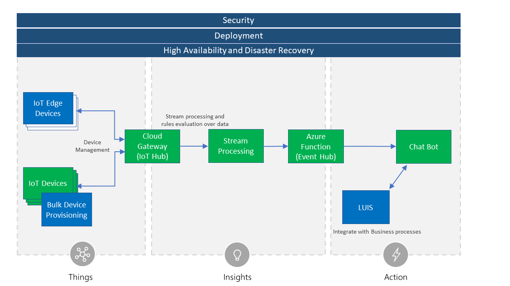

# NDC Minnesota 2018 Demo

#### Talk: Intelligent Interfaces with Cognitive APIs, BOTs and IOT
Modern IoT solutions have to process telemetry data in real-time and provide actionable intelligence. Come join us as we walk through a complete IoT solution from start to finish.

We’ll start with exploring how telemetry is ingested into the cloud, followed by performing data analysis using a lambda based architecture. From there we’ll sprinkle in serverless compute, natural language processing, and bots just to round it out.

